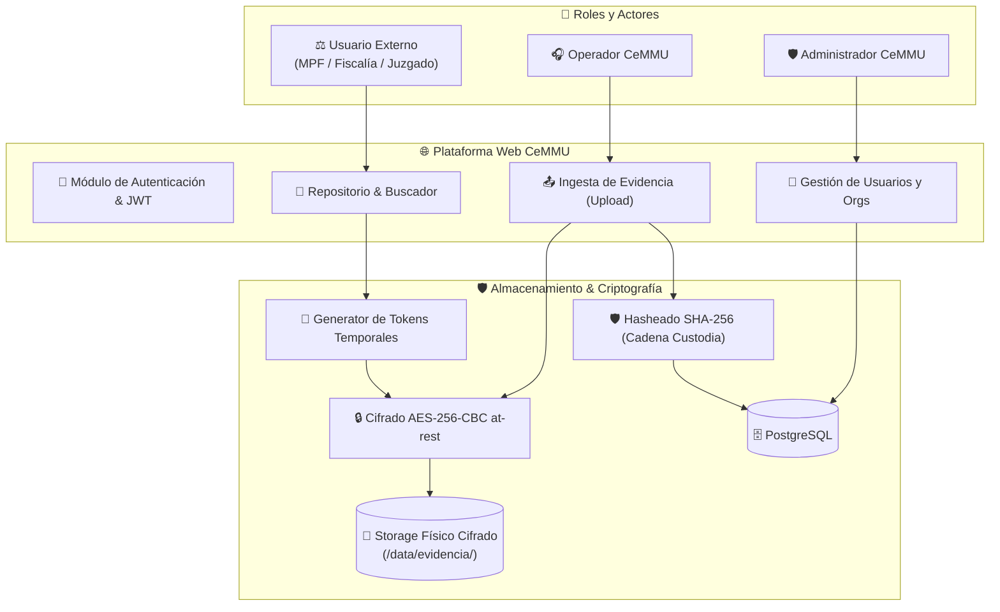
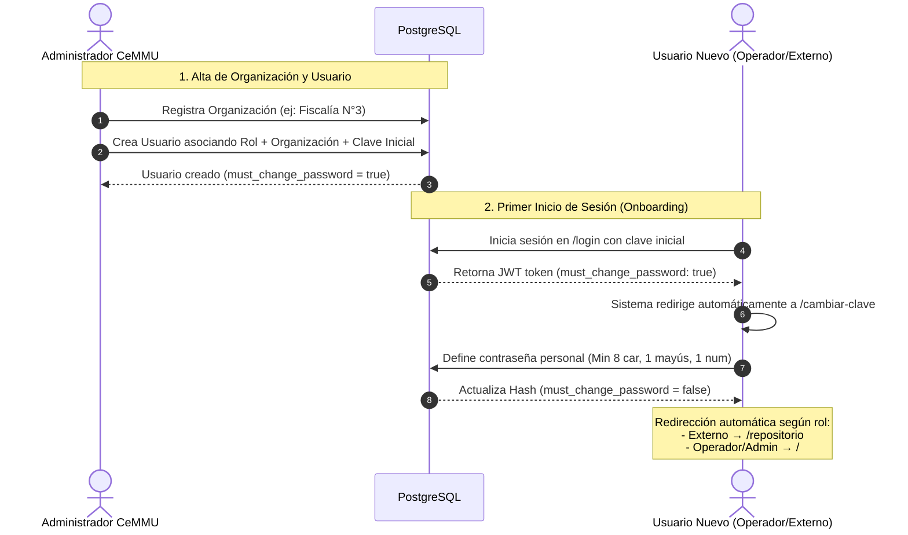
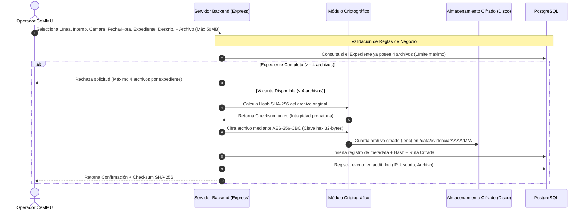
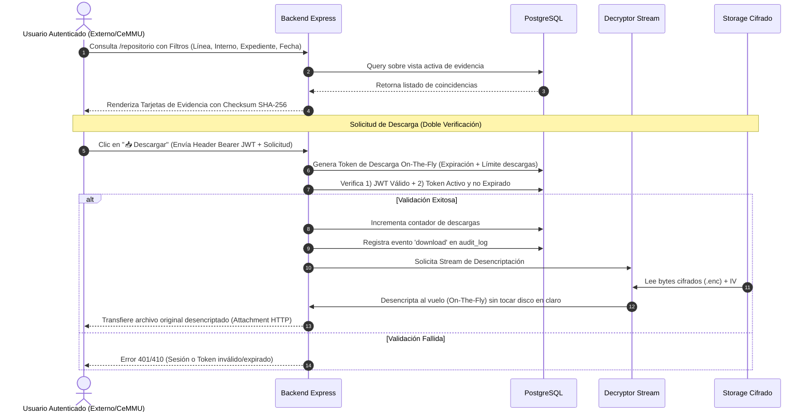

[flujo_evidencia_y_usuarios_cemmu.md](https://github.com/user-attachments/files/31179101/flujo_evidencia_y_usuarios_cemmu.md)
# Esquema de Procesos — Módulo de Evidencia Digital y Gestión de Usuarios CeMMU

Documento descriptivo de arquitectura, flujos operativos y protocolos de seguridad para la incorporación del módulo de **Gestión de Usuarios, Organizaciones y Evidencia Audiovisual Digital** en la plataforma del Centro de Monitoreo de Movilidad Urbana (CeMMU).

---

## 1. Visión General de la Arquitectura

---

## 2. Flujo 1: Gestión de Usuarios y Organizaciones

### Descripción del Proceso
Permite administrar las identidades digitales de la plataforma, diferenciando el personal interno del CeMMU de los organismos judiciales solicitantes.

---

## 3. Flujo 2: Ingesta de Evidencia Digital (Upload de Cámaras)

### Descripción del Proceso
Los operadores del CeMMU receptan o extraen fragmentos de video provenientes de las **4 cámaras por unidad de colectivo**:
1. **Frontal (calle)**
2. **Escalera de ascenso**
3. **Asiento del chofer**
4. **Fondo interior**

---

## 4. Flujo 3: Consulta y Descarga Segura (Doble Verificación)

### Descripción del Proceso
Garantiza que la evidencia sea accesible únicamente por personal autenticado, protegiendo la descarga mediante un enlace temporal y verificación cruzada.

---

## 5. Matriz de Roles y Permisos

| Módulo / Funcionalidad | Administrador CeMMU | Operador CeMMU | Usuario Externo (MPF/Juzgado) |
|---|:---:|:---:|:---:|
| **Acceso a Panel Registros Frecuencia** | ✅ | ✅ | ❌ |
| **Acceso a Dashboard Analítico** | ✅ | ❌ | ❌ |
| **Gestión de Usuarios (CRUD)** | ✅ | ❌ | ❌ |
| **Gestión de Organizaciones (CRUD)** | ✅ | ❌ | ❌ |
| **Resetear Claves de Terceros** | ✅ | ❌ | ❌ |
| **Upload de Evidencia Digital** | ✅ | ✅ | ❌ |
| **Consulta de Repositorio** | ✅ | ✅ | ✅ |
| **Descarga Directa de Archivos** | ✅ | ✅ | ✅ |
| **Generación de Enlaces Temporales** | ✅ | ✅ | ❌ |
| **Eliminación Definitiva de Evidencia** | ✅ | ❌ | ❌ |
| **Consulta de Logs de Auditoría** | ✅ | ❌ | ❌ |

---

## 6. Ficha Técnica de Seguridad

- **Cifrado en Reposo (At-Rest):** Algoritmo **AES-256-CBC** con Vector de Inicialización (IV) de 16 bytes antepuesto por archivo.
- **Integridad Probatoria:** Hash **SHA-256** calculado pre-cifrado para garantizar la preservación de la cadena de custodia.
- **Trazabilidad Inalterable:** Tabla `audit_log` donde se registra automáticamente cada inicio de sesión, cambio de clave, creación de usuarios, subida de archivos y descargas realizadas con dirección IP y timestamp.
- **Eliminación Física (Hard Delete):** La desvinculación de registros elimina físicamente las entidades de PostgreSQL resguardando automáticamente los registros de auditoría históricos mediante nulificación de claves foráneas.
